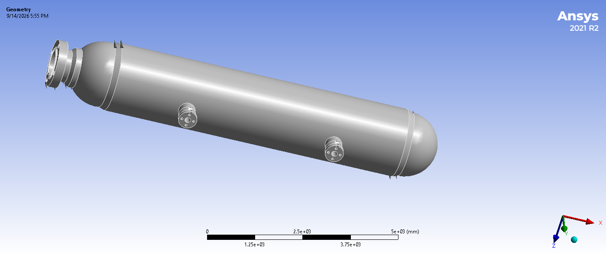
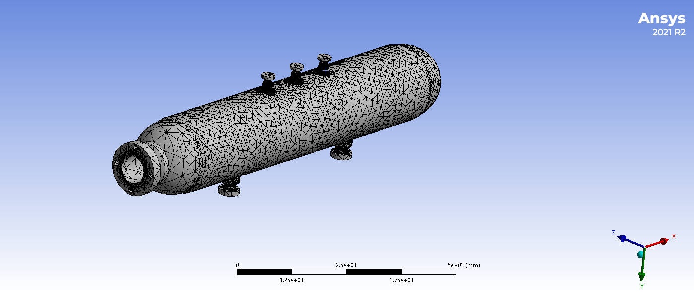
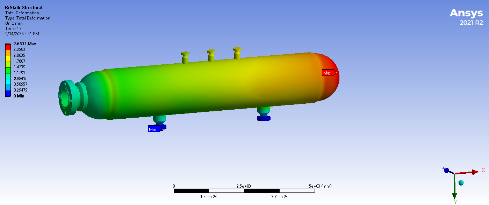
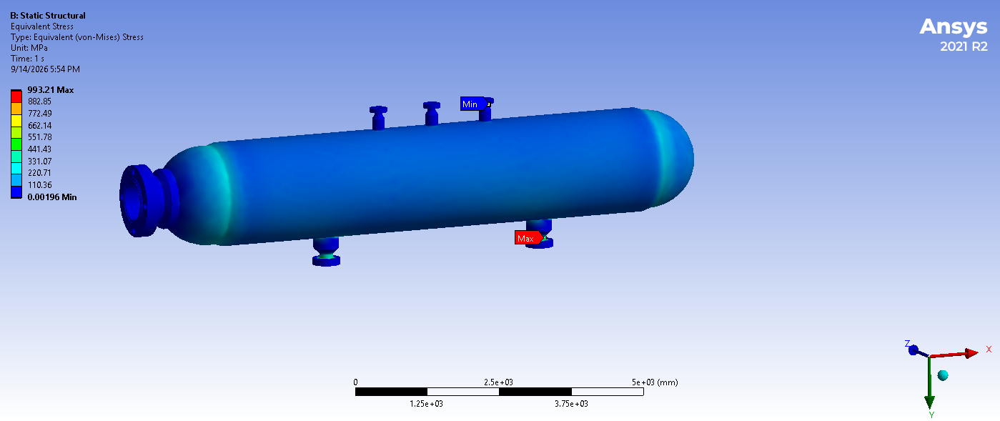

# Pressure Vessel Static Structural Analysis

This project presents a comprehensive finite element analysis (FEA) of a pressure vessel performed using **Ansys Workbench**. The analysis focuses on stress distribution and structural integrity under operational conditions.

## Project Overview
The main goal of this analysis is to evaluate the mechanical behavior of a pressure vessel under internal pressure and gravitational loads, ensuring the design adheres to structural safety limits.

## Analysis Steps

### 1. Geometry Modeling
The pressure vessel was modeled in **SolidWorks**, including the main cylindrical shell, heads, nozzles, and support saddles to simulate real-world conditions.

### 2. Meshing & Refinement
To ensure accuracy, a structured mesh was generated. We applied **Mesh Refinement** at critical locations—specifically at the nozzle-to-shell connections and saddle-support areas—where stress concentrations are expected.

### 3. Boundary Conditions
- **Internal Pressure:** 20 MPa, applied to the inner surfaces.
- **Gravity Load:** `Standard Earth Gravity` (9806.6 mm/s²) applied to account for the dead weight of the vessel.
- **Supports:** `Fixed Support` was applied to the saddle base plates to simulate the foundation connection.
- **Displacement:** A free-movement boundary condition was applied in the axial (X) direction on one of the flanges to allow for pressure-induced expansion.

## Results & Post-Processing

### Total Deformation
The deformation analysis confirms the structural displacement under maximum pressure.

### Equivalent (Von-Mises) Stress
The stress distribution analysis identifies areas of high stress concentration.

## Technical Highlights
- **Theoretical Validation:** The numerical results obtained from Ansys were compared with classical stress formulas (Hoop & Longitudinal stress) to ensure the validity of the FEA model.
- **Mesh Optimization:** By using Mesh Refinement, the solution accuracy in critical regions was significantly improved without unnecessary increase in computational time.
- **Safety Margin:** The maximum equivalent stress was compared against the material's yield strength, confirming that the design remains within the elastic region.

---
*Project conducted by: Elnaz Keshtkar*